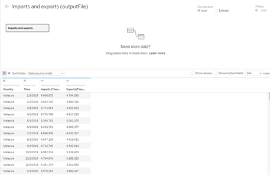
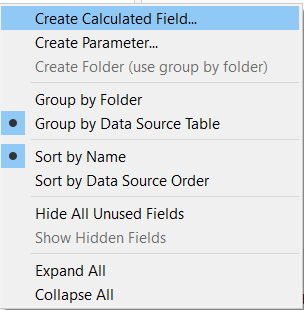
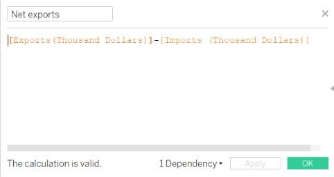
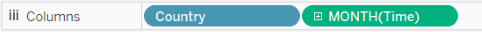
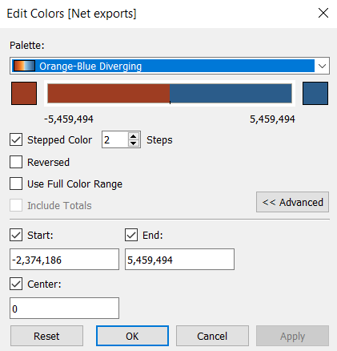
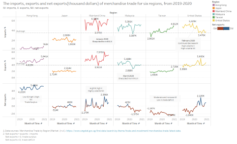

```{r setup, include=FALSE}
knitr::opts_chunk$set(echo = FALSE)
```

# 1.0 Critique of Visualization
The original visualization can be seen below.


### 1.1 Clarity
1. The title of the graph does not convey the intent of the graph well.

    + In this case, the graph is trying to show changes in import and export amounts over time for six trading countries and compare them.
    + 'Top' included in the header, but ranking the total imports and exports in the source data(from 2019 to 2020), not exactly these six countries. 
    + The title does not indicate the unit of calculation of the import and export amount.
    + The time indicated in the title and the time shown in the chart contradict each other. The title indicates that the chart shows the amount of import and export data from 2019 to 2020, but the graphs of Hong Kong, Mainland China, Malaysia, Taiwan and US show the amount from 2019-2021. And the graph of Japan show the amount of 2020 only.
    
2. The content of the graph

    + The area charts are used, which can mislead people into thinking that the areas are meant to show the cumulative imports and exports. However the main topic is to look at the yearly change of import and export amount and compare them.
    + Y-axis: the units of the y-axis are not uniform(between the six graphs and even for the export and import in the same graph) which is difficult to compare. This does not help to reflect the shortfall between imports and exports.
    + X-axis: the ranges of x-axis of six countries are different. The range of x-axis of Hong Kong, Mainland China, Malaysia, Taiwan and US are from 2019-2021. And the time of Japan is 2020 only.
    
### 1.2 Aesthetic
1. There is poor use of colors in the chart. The large number of overlapping blue and orange blocks in the chart can be confusing.
2. Both values of x-axis and y-axis are not uniform
3. There is no annotations used to convey important points, leaving the reader to infer the purpose of the graph.
4. There is no data sources.

# 2.0 Alternative Design
The proposed design is as follows.


### 2.1 Clarity
1. Delete the 'top' included in the title to avoid spreading the wrong information. 
2. Title and subtitle show the objectives and explain abbreviations and definitions that will be used in the graph. 
3. Add a new calculated field 'Net exports(exports-imports)' to show the changes in the balance. And add the caption to explain the calculation function of net exports, trade surplus and trade deficit.
4. Exports, imports, and net exports for the six countries have the same scale on the x-axis separately, making it easy to compare the data for the six countries.
5. The units of the y-axis are uniform. All six countries use the data from Jan 2019 to Dec 2020.

### 2.2 Aesthetic
1. Annotations are used to emphasize key observations. 
2. Color is used to bring to attention different categories(different countries, trade surplus and trade deficit)
3. Add data sources and explanation to help customers to read the graph.

# 3.0 Proposed Visualization
Please view the interactive visualization on Tableau Public here(link--tableau public)

# 4.0 Step-by-step Guide
No|Step      |Action
--|----------|----------
1|Select the import and export amounts of HongKong, Japan, Mainland China, Taiwan, Malaysia and United state from the source file.| Show imports as a example  
2|Select the data from Jan 2019 to Dec 2020.|Show imports as a example  
3|Compare the data of imports and exports and adjust the form.| Show part of the document  
4|Import the data into Tableau.| 
5|Adjust the data type of variables.| 
6|Add the title and subtitle.| 
7|Add the caption.| 
8|Right click on the blank area of <font color=blue>*'Data'*</font> area. Create a new calculation field to show the changes in the balance.| 
9|The new calculation field called <font color=blue>*'Net Exports'*</font> which is equal to exports minus imports.|  
10|Right click on the small triangle of <font color=blue>*'YEAR(Time)'*</font> area.Put the <font color=blue>*'Time'*</font> into the **Columns** and change the unit from <font color=blue>*'YEAR'*</font> to <font color=blue>*'Month'*</font>.| 
11|Put the <font color=blue>*'Country'*</font> into the **Columns**| 
12|Put the <font color=blue>*'Imports(Thousand Dollars)'*</font>,<font color=blue> *'Exports(Thousand DOllars)'*</font> and <font color=blue>*'Net exports'*</font> into the **Rows**.|  
13|Right click on the small triangle of <font color=blue>*'CNTD'*</font> area.Change the **measure** way of the <font color=blue>*'Imports(Thousand Dollars)'*</font> and <font color=blue> *'Exports(Thousand DOllars)'*</font>.| 
14|Change the **Marks** of <font color=blue>*'SUM(Imports(Thousand Dollars))'*</font>. Use <font color=blue>*'Country'*</font> as <font color=blue>*'Color'*</font> and <font color=blue>*'SUM(Imports(Thousand Dollars))'*</font> as <font color=blue>*'Label'*</font>.| 
15|Change the **Marks** of <font color=blue>*'SUM(Exports(Thousand Dollars))'*</font>. Use <font color=blue>*'Country'*</font> as <font color=blue>*'Color'*</font> and <font color=blue>*'SUM(Exports(Thousand Dollars))'*</font> as <font color=blue>*'Label'*</font>.| 
16|Change the **Marks** of <font color=blue>*'SUM(Net exports(Thousand Dollars))'*</font>. Use <font color=blue>*'SUM(Net exports(Thousand Dollars))'*</font> as <font color=blue>*'Color'*</font> and <font color=blue>*'SUM(Net exports(Thousand Dollars))'*</font> as <font color=blue>*'Label'*</font>.| 
17|Change the  <font color=blue>*'Label'*</font> format for aesthetic. Set the number with 0 decimal places and thousands unit.| 
18|Change the <font color=blue>*'Label'*</font> display from show all to show only the maximum and minimum values.| 
19|Change the <font color=blue>*'Color'*</font> of <font color=blue>*'SUM(Net exports(Thousand Dollars))'*</font>. The negative number is red and the positive is blue.| 
20|Right click on the main graph area or the important points and select annotate. Type in insights and observations in the text area. Arrange, resize, or format the resulting text box if required.| 
21|The final dashboard is ready!| 

# 5.0 Derived Insights


